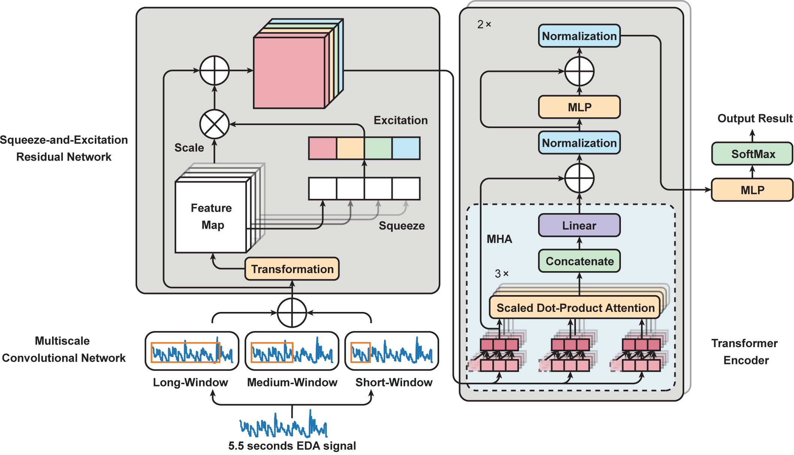

## Transformer Encoder with Multiscale Deep Learning for Pain Classification Using Physiological Signals


### Our new paper just released on Frontiers in Physiology: https://www.frontiersin.org/articles/10.3389/fphys.2023.1294577/full


## Abstract


<div style="text-align:center">
  
</div>

Pain is a global health problem impacting a significant proportion of the population. Accurate assessments are crucial for effective pain management and treatment. Current methods, \eg self-report scales, can be biased and inconsistent. Therefore, there is a need for objective and automatic pain intensity evaluation. In this paper, we propose PainAttnNet, a novel transformer-encoder deep learning framework for classifying pain intensities using physiological signals. PainAttnNet integrates multiscale convolutional networks to capture short- and long-window sequential features, a squeeze-and-excitation residual network emphasizing interdependencies among relevant features, and a transformer encoder block for optimal feature extraction and temporal dependency analysis. Utilizing the publicly available BioVid heat pain database, PainAttnNet outperforms state-of-the-art models, demonstrating its potential for automated pain intensity classification. Our results suggest that PainAttnNet can enhance pain assessment using physiological signals benefitting further pain management and treatment.


## Directory Structure
```python
PainAttnNet
|   environment.yml # Requirements for conda environment
|   LICENSE
|   README.md
|   requirments.txt # Requirements for pip environment
|          
+---jq
|       jq-win64.exe
|       
\---src
    |   batch_train.sh # Training script
    |   config.json # Training configurations
    |   logger_config.json # Logger configurations
    |   parser.py # Parser for training configurations
    |   train_kfold_cv.py # Main training script
    |  __init__.py
    |   
    +---models
    |   |   main_painAttnNet.py # Main model wrapper
    |   |   module_mscn.py* # Multiscale convolutional network
    |   |   module_se_resnet.py # Squeeze-and-excitation residual network
    |   |   module_transformer_encoder.py # Transformer encoder block
    |   \   __init__.py
    |           
    +---tests # Unit tests
    |   |   test_generate_kfolds_index.py
    |   |   test_mscn.py
    |   |   test_PainAttnNet_output.py
    |   |   test_process_bioVid.py
    |   |   test_se_resnet.py
    |   |   test_transformer_encoder.py
    |   \   __init__.py
    |           
    +---trainers # Training modules
    |   |   checkpoint_handler.py # Checkpoint handler
    |   |   device_prep.py # Device preparation, CPU or GPU
    |   |   main_trainer.py # Main trainer scripts
    |   |   metrics_manager.py # Metrics manager and other metrics functions
    |   \   __init__.py
    |           
    \---utils
        |   process_bioVid.py # Data processing for BioVid
        |   utils.py # Other utility functions
        \   __init__.py

```  
## Updates

`update 12/11/2023` Paper published on Frontiers in Physiology.

`update 4/21/2023`  Full code is released.

`update 4/20/2023`  The strutrue of MSCN currently in the code has three convolutional layers for three scales (slightly different from the paper), but this can be easily changed by modifying the code.


## Get Started

```
torchaudio==0.13.0
python==3.10.8
pytorch-cuda==11.7
pytorch==1.13.0
torchvision==0.14.0
scikit-learn==1.0.1
pandas
matplotlib
openpyxl
```
For Linux users, install `jq` package via conda or pip.

For Windows users, install `jq` package from [here](https://stedolan.github.io/jq/download/), and put the `jq.exe` file in the local directory.


## Training


### Training k-fold cross validation with script
```
sh batch_train.sh
```
### Training individual fold in terminal
```
python train_kfold_cv.py --fold_i {fold index}
```

You can change settings at `main_painAttnNet.py` for tuning model structure, `config.py` for training configurations and `train_kfold_cv.py` for others.


## Dataset
The dataset is available at [BioVid Heat Pain Database](https://www.nit.ovgu.de/BioVid.html).

## Reference

If you find our study useful, please cite our paper on Frontiers
```
@article{10.3389/fphys.2023.1294577,
AUTHOR={Lu, Zhenyuan and Ozek, Burcu and Kamarthi, Sagar},   
TITLE={Transformer encoder with multiscale deep learning for pain classification using physiological signals},      
JOURNAL={Frontiers in Physiology},      
VOLUME={14},           
YEAR={2023},      
URL={https://www.frontiersin.org/articles/10.3389/fphys.2023.1294577},       
DOI={10.3389/fphys.2023.1294577},      
ISSN={1664-042X},
}
```

## Contact
Zhenyuan Lu\
Northeastern University, Boston\
Email: lu.zhenyua[at]northeastern[dot]edu
